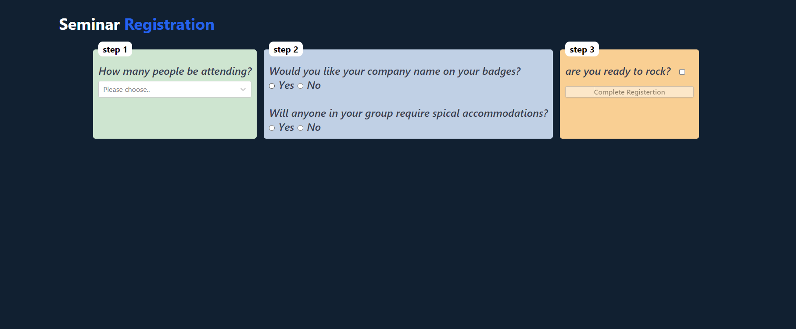
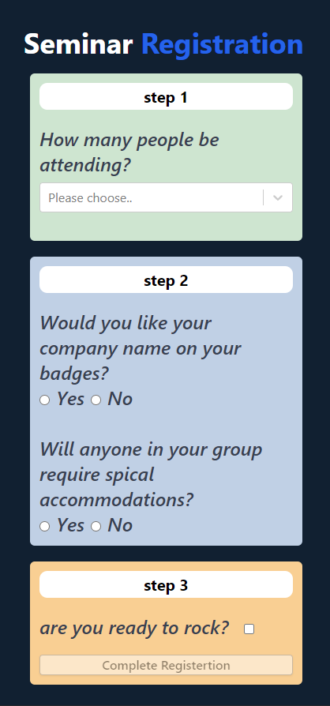

# axenso -  Next.js 
## screenShots
### web view


### mobile view


## Table of Contents
1. [Features](#features)
1. [Requirements](#requirements)
1. [Getting Started](#getting-started)
1. [Application Structure](#application-structure)
1. [Styles](#styles)

## Features
* [react](https://github.com/facebook/react)
* [Next.js](https://github.com/vercel/next.js/)
* [react-select](https://www.npmjs.com/package/react-select)
* [prop-types](https://www.npmjs.com/package/prop-types)
* [sass](https://github.com/sass/sass)
* [tailwindcss](https://github.com/tailwindlabs/tailwindcss)
* [eslint](http://eslint.org)
* [classnames](https://github.com/JedWatson/classnames)
* [responsive Design](#)

## Requirements
* node `^14.17.3`
* npm `^6.14.13`
* yarn `^1.22.10`

### Getting Started

First, clone the project:

```bash
$ git clone https://github.com/akram-tello/axenso.git <my-project-name>
$ cd <my-project-name>
```

Then install dependencies and check to see it works

```bash
$ npm install            # Install project dependencies
$ npm run dev            # Compile and launch
```
If everything works, you should have a working <b>Seminar Registration Form</b>

While developing, you will probably rely mostly on `npm start`; however, there are additional scripts at your disposal:

|`npm run <script>`|Description|
|------------------|-----------|
|`start`|Serves your app at `localhost:3000`. HMR will be enabled in development.|
|`build`|build the application to disk (`.next` by default).|
|`dev`|Same as `npm start`, but enables nodemon for the server as well.|
|`lint`|Lint all `.js` files.|

## Application Structure

The application structure presented in this boilerplate is **fractal**, where functionality is grouped primarily by feature rather than file type. Please note, however, that this structure is only meant to serve as a guide, it is by no means prescriptive. That said, it aims to represent generally accepted guidelines and patterns for building scalable applications. If you wish to read more about this pattern, please check out this [awesome writeup](https://github.com/davezuko/react-redux-starter-kit/wiki/Fractal-Project-Structure) by [Justin Greenberg](https://github.com/justingreenberg).

```
.
│   .eslintrc.json              # Once ESLint has been set up, it will also automatically run during every build ( next build ), it helps to catch errors.
│   .nvmrc                      # containing a node version of the project.
│   next.config.js              # regular Node. js module, not a JSON file. It gets used by the Next. js server and build phases.
│   package-lock.json           # automatically generated for any operations where npm modifies either the node_modules tree, or package. json.
│   package.json                # contain all dependencies and scripts that used in this project. 
│   postcss.config.js           # tool for transforming styles with JS plugins.    
│   tailwind.config.js          # configuration file for Tailwindcss styles.
│
├───components                  # Global Reusable Presentational Components
│   └───Form                    # Form Component
│       │   Form.js
│       │
│       └───components          # Child Components that related to Form Component
│               CheckBox.js
│               RadioBox.js
│               SelectBox.js
│
├───pages                       
│       index.js                # Main page container for app                
│       _app.js                 # Bootstrap main application
│
├───public
│       favicon.ico
│       vercel.svg
│
└───styles                      # Application-wide styles folder.             
    │   globals.css
    │   globals.css.map
    │   globals.scss
    │
    └───modules                 # modules scss styles folder
            _form.module.scss
```

## Styles

Used tailwindcss as main style lib with Sass, Both `.scss` and `.css` file extensions are supported out of the box. After being imported, styles will be processed with [PostCSS] for minification and autoprefixing, and will be extracted to a `.css` file during production builds.

